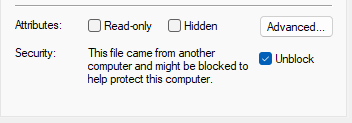

# Mission Macro

A simple plugin for ArduPilot's [Mission Planner](https://ardupilot.org/planner/). Uses a template mission to alter the one currently being edited in the PLAN view.

[LICENSE](https://github.com/ArduPilot/MissionPlanner/blob/master/COPYING.txt)

## Installation

- Copy the latest `MissionMacro.dll` from [Releases](https://github.com/yuri-rage/mission-planner-macro-plugin/releases) to your Mission Planner installation directory.
	- Typically `C:\Program Files (x86)\Mission Planner\plugins\`
- Windows may automatically block the unsigned library file. To unblock it, right click the filename in Windows Explorer and select "Properties." Then check "Unblock" and click "Ok."

   

- Restart Mission Planner if it was already open.

## Usage

Create a template mission containing commands you wish to use frequently. Structure it like so:

   

In this example, the following is the intended outcome:

1. DO_SET_SERVO sets servo 4 to 1450μs (a mid-range engine RPM in the example case)
2. DELAY briefly for the engine to spool
3. DO_JUMP - **special case:** instead of setting parameter 1 as usual for a DO_JUMP command, parameter 4 is set to 1. This is a directive to the macro processor to insert existing on-screen waypoints up to and including this one, and then resume adding the macro template commands. In this case, we add waypoint 1 and then move on.
4. DO_SET_RELAY turns on relay 2 (mower deck PTO) after reaching waypoint 1
5. DELAY waits for PTO engagement
6. DO_SET_SERVO sets servo 4 to mowing engine speed
7. DELAY waits briefly for the engine to spool
8. DO_JUMP - **special case:** parameter 4 is set to 9999, which will insert the remaining on-screen waypoints and then come back to the macro processor for the last 3 commands. The value must simply be larger than the number of waypoints for any given mission. Since 9999 is impossibly large given current ArduPilot mission constraints, this will always cycle the macro processor to the end of a mission.
9. DO_SET_RELAY turns the mower deck PTO off
10. DELAY briefly
11. DO_SET_SERVO brings the engine back to idle to await further RC or GCS commands

Save this mission to a file. Then clear it and plan waypoints as usual. When finished, right click the map and select "Add Macro." Choose the file you saved previously. The commands will be added in the order specified.

To simplify the example in plain English:
Set mid-range RPM (servo 4) for travel to waypoint 1. Upon reaching waypoint 1, turn on the mower deck (relay 2) and increase engine RPM for mowing. Continue mowing. Upon reaching the last waypoint, turn off the mower deck and set engine idle.

The same type of strategy can be used for any number of vehicle types and could ease the planning burden for anything from automated agricultural mowing/spraying/etc to aerial survey with a canned route to/from an area of interest to fixed wing recovery using the same traffic pattern, and so on.